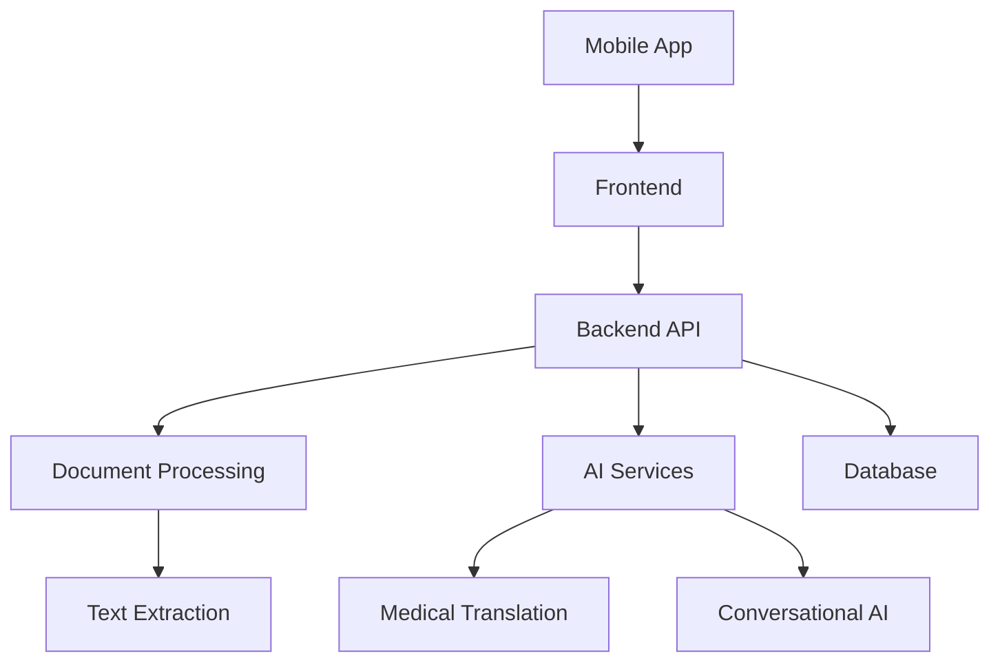

# System Patterns

## Architecture Overview

## Frontend Architecture
1. Component Structure
   - Atomic Design Pattern
   - Feature-based organization
   - Shared component library
   - Custom hooks for logic

2. State Management
   - TanStack Query for server state
   - React Context for UI state
   - Local storage for persistence
   - Real-time updates

3. Routing
   - Protected routes
   - Deep linking support
   - Navigation history
   - Route guards

## Backend Architecture
1. API Design
   - RESTful endpoints
   - GraphQL for complex queries
   - Rate limiting
   - Request validation

2. Service Layer
   - Document processing service
   - AI integration service
   - Authentication service
   - Storage service

3. Data Flow
   - Event-driven architecture
   - Message queues
   - Caching strategy
   - Data validation

## AI Integration
1. Document Processing
   - OCR for images
   - PDF parsing
   - Text chunking
   - Medical term detection

2. Translation Pipeline
   - Medical term mapping
   - Context analysis
   - Reference linking
   - Alert generation

3. Conversational AI
   - Context management
   - Query processing
   - Response generation
   - History tracking

## Security Patterns
1. Authentication
   - JWT tokens
   - Refresh tokens
   - Session management
   - 2FA support

2. Data Protection
   - End-to-end encryption
   - Secure storage
   - Data masking
   - Access control

3. Compliance
   - HIPAA guidelines
   - Data retention
   - Audit logging
   - Privacy controls

## Testing Strategy
1. Unit Testing
   - Component tests
   - Service tests
   - Utility tests
   - Hook tests

2. Integration Testing
   - API tests
   - Flow tests
   - State tests
   - Error handling

3. E2E Testing
   - User flows
   - Critical paths
   - Edge cases
   - Performance tests

## UI Patterns

### Upload Flow
1. Initial Upload State
   - Clean interface with drag-and-drop area
   - File selection button
   - Supported file types indication

2. Upload States
   - Processing: Loading indicator with progress feedback
   - Success: Visual confirmation with checkmark
   - Denied: Clear error message with retry option
   - Error: Error message with troubleshooting steps

### Results Display
1. Archive View
   - List/Grid toggle
   - Sorting options
   - Bookmark functionality
   - Empty state handling

2. Detail View
   - Report sections
   - Bookmark options
   - Share functionality
   - Export options

### Chat Interface
1. Basic Chat
   - Message history
   - Input area
   - Send button
   - Loading states

2. AI Expanded View
   - Full context display
   - Advanced options
   - Reference links
   - Action buttons

### Component Patterns
1. Foundational Components
   - Button variants
   - Input fields
   - Cards
   - Icons system
   - Typography scale

2. Import Area Component
   - Drag-and-drop zone
   - File selection
   - Upload progress
   - Status indicators

### Navigation
1. Main Navigation
   - Home
   - Results
   - Archive
   - Profile

2. Secondary Navigation
   - Breadcrumbs
   - Back buttons
   - Section tabs

### Feedback States
1. Loading States
   - Skeleton screens
   - Progress indicators
   - Processing animations

2. Empty States
   - No results
   - No bookmarks
   - First-time user

3. Error States
   - Access denied
   - Upload failed
   - Processing error
   - Network error 